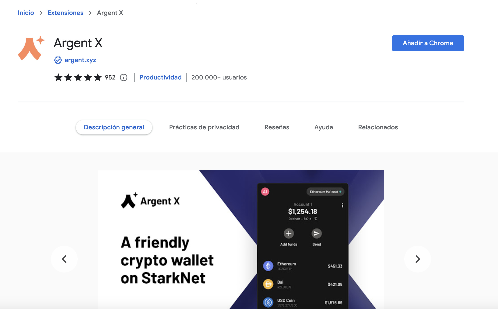
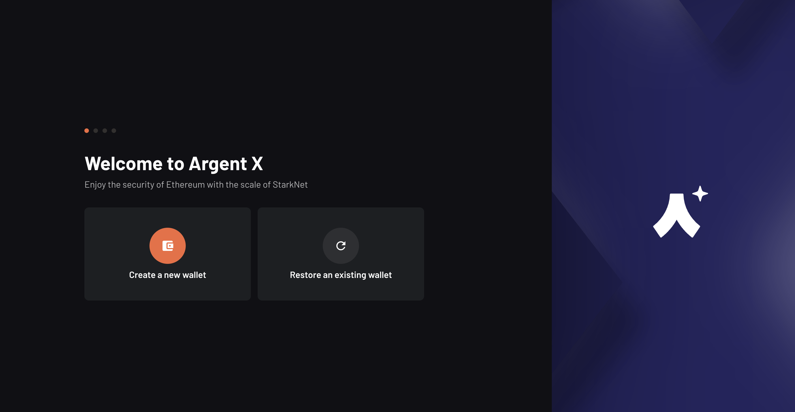
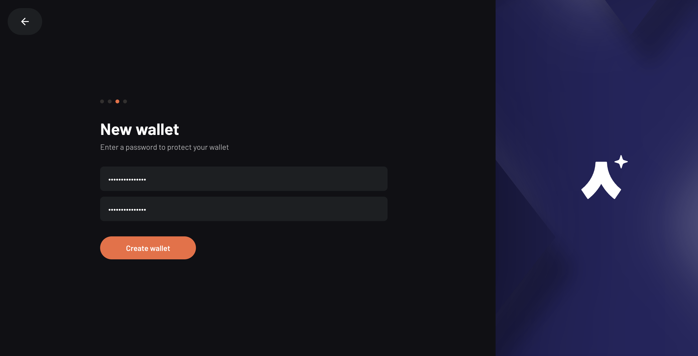
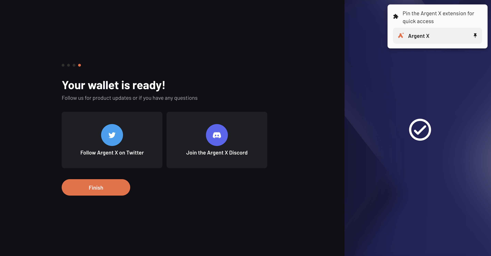
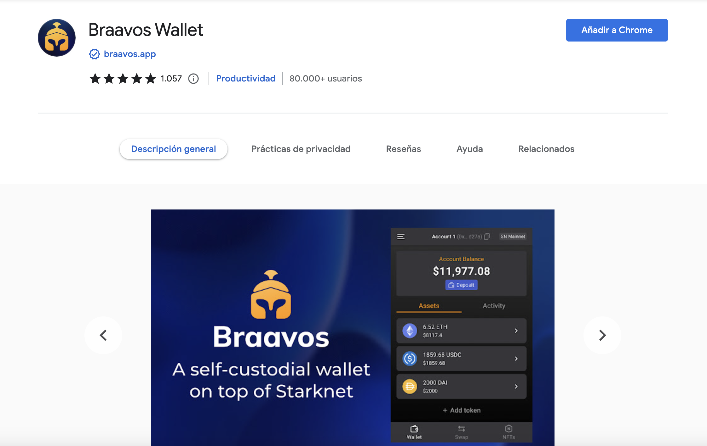
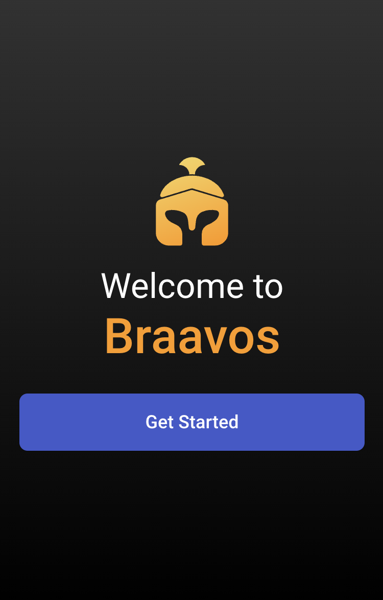
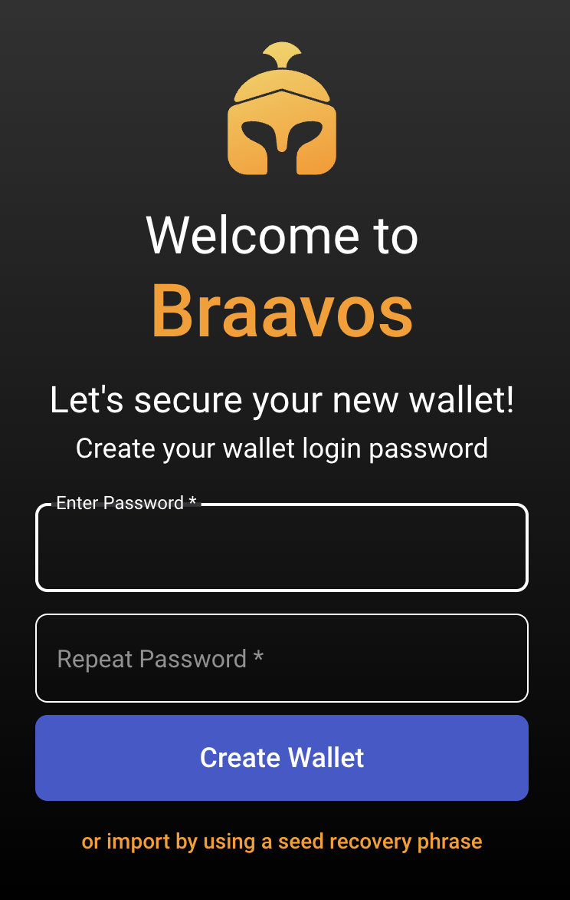
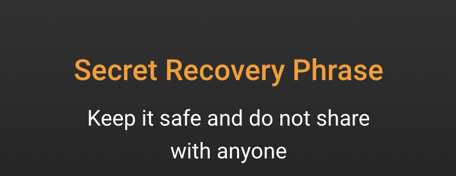
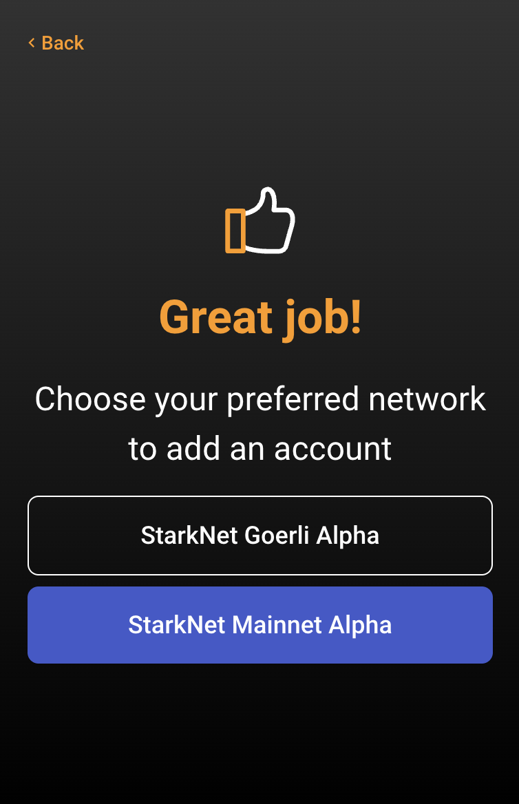

import QuizProgress from '@site/src/components/QuizProgress';
import QuizForm from '@site/src/components/QuizForm';

<QuizProgress courseId={1} lessonId={1}></QuizProgress>

# WTF Starknet 1. Account Abstraction

What would happen if you lose access to the private keys of your wallet?

Nothing good, right?

Because your private key is your account, losing your key means losing your account, your money, your data. Everything.

With Account Abstraction (AA) if a user lose everything with a small mistake we can help them to recover their information, because every account is a smart contract that can contain logic and implement flow.

So allows us to use smart contract logic to specify not just the effects of the transaction, but also the fee payment and validation logic. This allows many important security benefits, such as multisig and smart recovery wallets, being able to change keys without changing wallets, and quantum-safety.

## 1. How accounts works today

**Ethereum has two different types of "accounts":**

* Contract Accounts
* Externally Owned Accounts (EOAs)

*EOAs is regular user accounts.*

There's some [Key differences](https://ethereum.org/en/developers/docs/accounts/) between EOAs and Contracts.

**Both account types have the ability to:**

* Receive, hold and send ETH and tokens
* Interact with deployed smart contracts

## 2. Accounts in AA

Account Abstraction unifies Contract Accounts and EOAs. 

It makes user accounts more ‘programmable’. You remove the logic of signing transactions from the account, and you “abstract” it out, hence account abstraction.

The new experiences you see being built are features made possible by account abstraction but not by account abstraction itself. 

It’s no longer one-account-fits-all-use-cases. Instead, each user can have an account that is adapted to their needs. 

* If you want to use a signing scheme other than ECDSA, you can write an account to do that.
* If you want to use multiples keys to authorize transactions, you can write an account to do that.
* If you want to change the signer of your account every week, you can write an account to do that too.

Thus AA provides you with "programmable transaction validity."

## 3. Starknet & Account Abstraction

Starknet focuses on some key components of the protocol:

1. Signature abstraction:
    * Allow different account contracts to use different signature validation schemes.
2. Payment abstraction:
    * Allow different models of payment for transactions. For example, payment by another party/contract.
    * Better UX: don’t mandate a specific token (native or contract-defined) to be used for paying for transactions.
    
    You can read the whole proposal [here](https://community.starknet.io/t/starknet-account-abstraction-model-part-1/781). They took the [ERC-4337](https://medium.com/infinitism/erc-4337-account-abstraction-without-ethereum-protocol-changes-d75c9d94dc4a) from Ethereum and improved the model.
    
## 4. Which wallets supports AA?

If we talk about wallets and tools that implements AA, we have two main options. Let's talk about it.

### 4.1 Argent

Argent X is the most popular and only open-source wallet on Starknet, you can buy and bridge crypto to Starknet, swap tokens, mint and store NFTs, play blockchain games and much more.

#### How to create an Argent X wallet

1.  Go to browser webstore, download Argent X, and add the extension.

2. Click "create a new wallet"

3. Read the disclaimers and click "continue"

4. Create a password for your wallet
 

5. Your wallet is ready! Click "finish" and pin the Argent X extension in your browser for quick access if you want.

6. Open your wallet extension and now you're ready to use it

#### FYI

*Every transaction on the blockchain requires gas, which is a small amount of crypto, to make transactions. Before you begin exploring Starknet mainnet, you will need to fund your Argent X wallet, so you can deploy your wallet. This is because every wallet on Starknet is a smart contract (remember AA class) and requires a small on-chain transaction to activate your wallet.*

After that, you're gonna be able to send, swap and add tokens, etc.

#### Argent X Features

The Argent X wallet has features that you would expect from a cryptocurrency wallet like global on-ramp or bridge funds. But Argent X is a smart wallet that has unique features made possible by being built on Starknet. 

* Fraud monitoring.
* Transaction review.
* Batch transactions together.
* Social recovery.
* Session keys.

Now you know, time to explore! 

### 4.2 Braavos

Braavos is not just a browser app but a native mobile app, so you can hodl your tokens, transfer, swap and manage your NFT collectibles, but even more so, access and connect to any dApp on Starknet from your phone.

Your mobile is always with you, allowing you to access crypto whenever and wherever you want with the privacy of your biometric encryption.

#### How to create a Braavos wallet

1.  Go to browser webstore, download Braavos, and add the extension.

2. Pin the Braavos extension in your browser for quick access and than click "Get Started"

3. Create a password for your wallet
 

4. Save the secret recovery phrase

5. Now you're ready to use your wallet

6. Remember that you have to deposit tokens in your wallet if you want to use the mainnet network, in order to active the smart contract account.

## 5. Summary

In this tutorial, we introduced Account Abstraction on Starknet, and how to set up an Argent/Braavos account.

<QuizForm link={"https://docs.google.com/forms/d/e/1FAIpQLScrzgrJ9sPCuGm4HYRCyLqnur9xp2B9rqGGzBp4suGUVZyOww/viewform?usp=sf_link"}></QuizForm>
